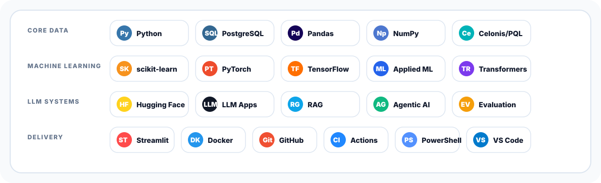

  

# Raphael Ifergan

**AI & Data Engineering | GenAI, Agentic AI, RAG, Applied ML**

Je construis des systèmes d'IA appliquée où les modèles sont reliés à des données, des outils, du retrieval et des boucles d'évaluation. Mon axe actuel est l'agentic AI pragmatique : des workflows où le LLM ne se limite pas à répondre, mais travaille dans une boucle contrôlée avec contexte, outils, preuves et revue.

Je suis étudiant en ingénierie IA à **l'ISEP**, apprenti chez **Renault Group**, basé à Paris, et ouvert à des opportunités full-time à partir de **septembre 2026**.

## Agentic AI Focus

Ce qui m'intéresse est la couche d'ingénierie autour des systèmes IA modernes :

- **Orchestration :** planning, routage, tool use, état et exécution contrôlée.
- **Grounding :** pipelines de retrieval, inspection des sources, citations et traçabilité.
- **Évaluation :** jeux de tests, analyse des échecs, source review et boucles de qualité.
- **Delivery :** interfaces simples, pipelines reproductibles et démos déployables.

## Projet public mis en avant

### [BOFiP Agentic RAG](https://github.com/Rapha1503/bofip-agentic-rag)

Projet de document intelligence agentique construit sur la doctrine fiscale française. Le domaine est fiscal, mais le problème d'ingénierie est plus large : ingérer un corpus difficile, retrouver les bonnes preuves, orchestrer des appels LLM, exposer les sources et évaluer les échecs honnêtement.

| Couche | Travail démontré |
| --- | --- |
| **Knowledge pipeline** | parsing, chunking, indexation et retrieval full-corpus |
| **Agentic layer** | query planning, source review, relances retrieval ciblées |
| **Grounded output** | réponses citées, sources visibles, interface Streamlit BYOK |
| **Évaluation** | jeu de questions, revue des résultats, analyse d'échecs et itération |

**Liens :** [Repository](https://github.com/Rapha1503/bofip-agentic-rag) / [Live demo](https://rapha1503-bofip-agentic-rag.hf.space/)

## Stack technique

  

## Expérience & formation

**Renault Group** - AI/Data Apprentice  
Travail appliqué en data et IA dans un environnement professionnel, avec attention à la qualité des données, aux contraintes métier et à la construction d'outils utilisables.

**ISEP** - Étudiant ingénieur, parcours AI/Data  
Cursus d'ingénieur orienté data science, machine learning et IA appliquée.

## Ouvert à

AI Engineer / Data Scientist / GenAI ou LLM Engineer / Applied AI Engineer / Data & AI Consultant

## Contact

- Email : [raphael.iferganpro@gmail.com](mailto:raphael.iferganpro@gmail.com)
- LinkedIn : [linkedin.com/in/raphaelifergan](https://www.linkedin.com/in/raphaelifergan/)
- English version: [README.md](README.md)
