  

  
  
  
  

# Raphael Ifergan

**AI & Data Engineering | GenAI, RAG, Applied ML**

I build practical AI systems for data-heavy problems: retrieval pipelines, LLM applications, evaluation loops, and machine-learning workflows that are clear enough to inspect, test, and improve.

Currently an AI engineering student at **ISEP** and apprentice at **Renault Group** in Paris. Open to full-time opportunities from **September 2026**.

## What I Build

| Direction | What it means in practice |
| --- | --- |
| **GenAI & RAG systems** | source-grounded answers, retrieval quality, citations, evaluation, BYOK demos |
| **Applied ML** | segmentation, classification, explainability, business-oriented modeling |
| **Data engineering for AI** | parsing, cleaning, indexing, reproducible pipelines, reliable datasets |

## Featured Case Study

### [BOFiP Agentic RAG](https://github.com/Rapha1503/bofip-agentic-rag)

A full-corpus RAG project over French tax doctrine, built to answer with cited BOFiP sources and visible retrieval evidence.

- Full corpus coverage, not a reduced demo.
- Hybrid retrieval experiments, chunk-level source inspection, and targeted retrieval relaunches.
- Streamlit BYOK interface deployed on Hugging Face Spaces.
- Evaluation workflow with a curated set of tax questions and documented failure analysis.

**Links:** [Repository](https://github.com/Rapha1503/bofip-agentic-rag) / [Live demo](https://rapha1503-bofip-agentic-rag.hf.space/)

## Stack

  

  
  
  
  
  
  
  
  

## Working Style

- I prefer systems that expose their evidence: logs, sources, tests, evaluations.
- I separate retrieval quality, model generation, and evaluation criteria instead of treating "the LLM answer" as one opaque block.
- I like projects that are useful enough to demo and reproducible enough for another engineer to inspect.

## Looking For

Full-time roles starting around **September 2026**:

- AI Engineer
- Data Scientist
- GenAI / LLM Engineer
- Applied AI Engineer
- Data / AI Consultant

## Contact

- Email: [raphael.iferganpro@gmail.com](mailto:raphael.iferganpro@gmail.com)
- LinkedIn: [linkedin.com/in/raphaelifergan](https://www.linkedin.com/in/raphaelifergan/)

